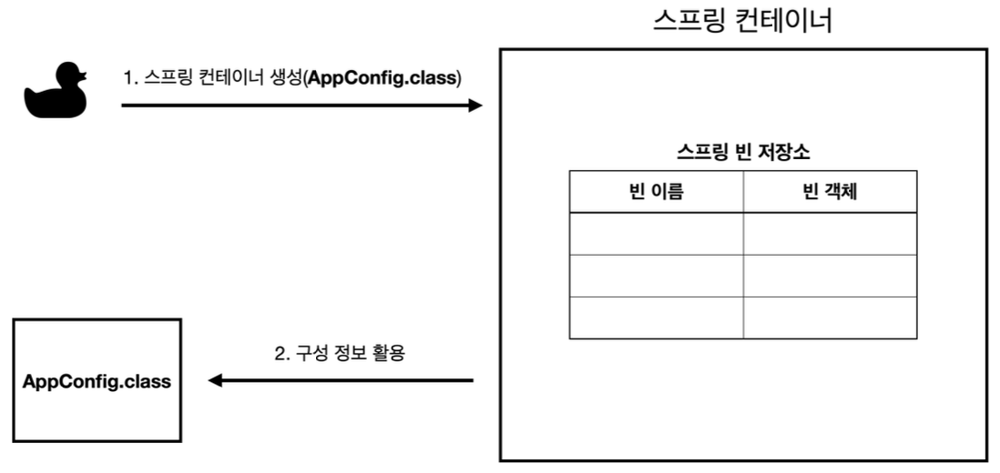
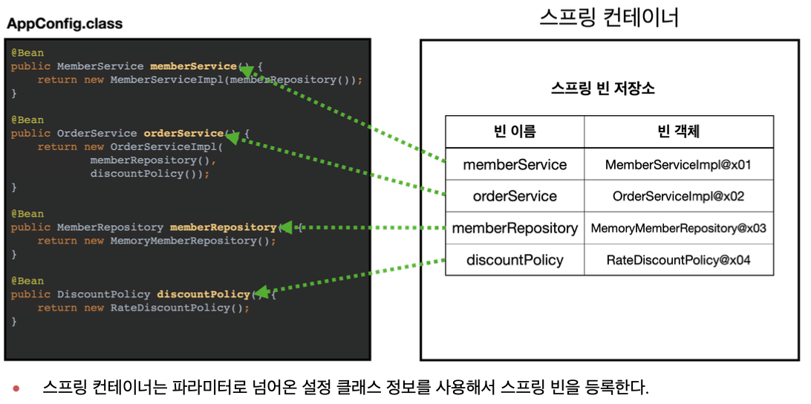
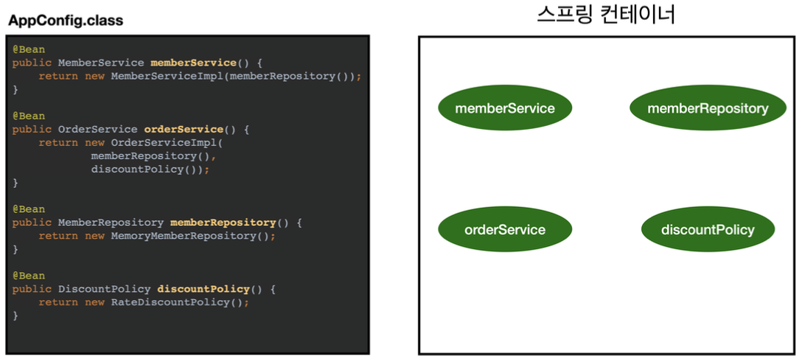
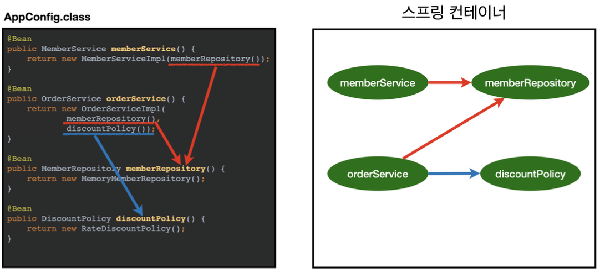
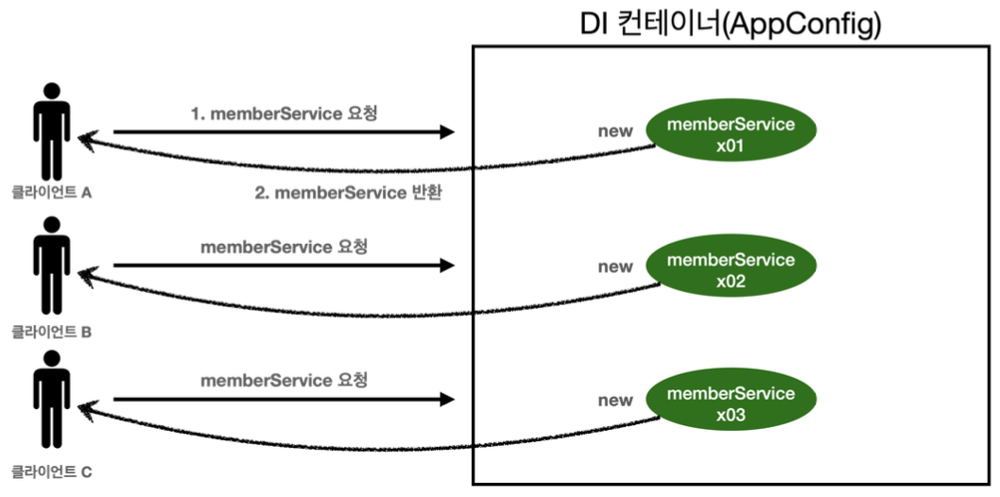

## 📌 스프링 컨테이너와 스프링 빈
### 스프링 컨테이너 생성
스프링 컨테이너가 생성되는 과정을 알아보자.
```java
//스프링 컨테이너 생성
ApplicationContext applicationContext =
    new AnnotationConfigApplicationContext(AppConfig.class);
```
                     
- `ApplicationContext` 를 스프링 컨테이너라 한다.
- `ApplicationContext` 는 인터페이스이다.
- 스프링 컨테이너는 XML을 기반으로 만들 수 있고, 애노테이션 기반의 자바 설정 클래스로 만들 수 있다.
- 직전에 `AppConfig` 를 사용했던 방식이 애노테이션 기반의 자바 설정 클래스로 스프링 컨테이너를 만든 것이다.
- 자바 설정 클래스를 기반으로 스프링 컨테이너(`ApplicationContext`) 를 만들어보자.
- `new AnnotationConfigApplicationContext(AppConfig.class);`
  이 클래스는 `ApplicationContext` 인터페이스의 구현체이다.

> 참고: 더 정확히는 스프링 컨테이너를 부를 때 `BeanFactory` , `ApplicationContext` 로 구분해서 이야기 한다. 이 부분은 뒤에서 설명하겠다. `BeanFactory` 를 직접 사용하는 경우는 거의 없으므로 일반적으로
`ApplicationContext` 를 스프링 컨테이너라 한다.


### 스프링 컨테이너의 생성 과정
1. 스프링 컨테이너 생성

- `new AnnotationConfigApplicationContext(AppConfig.class)`
- 스프링 컨테이너를 생성할 때는 구성 정보를 지정해주어야 한다.
- 여기서는 `AppConfig.class` 를 구성 정보로 지정했다.

2. 스프링 빈 등록

- 스프링 컨테이너는 파라미터로 넘어온 설정 클래스 정보를 사용해서 스프링 빈을 등록한다.

- 빈 이름
  - 빈 이름은 메서드 이름을 사용한다.
  - 빈 이름을 직접 부여할 수 도 있다.
  - `@Bean(name="memberService2")`
  > **주의: 빈 이름은 항상 다른 이름을 부여**해야 한다. 같은 이름을 부여하면, 다른 빈이 무시되거나, 기존 빈을 덮어버리거나 설정에 따라 오류가 발생한다.

3. 스프링 빈 의존관계 설정 - 준비


4. 스프링 빈 의존관계 설정 - 완료


- 스프링 컨테이너는 설정 정보를 참고해서 의존관계를 주입(DI)한다.
- 단순히 자바 코드를 호출하는 것 같지만, 차이가 있다. 이 차이는 뒤에 싱글톤 컨테이너에서 설명한다.

**참고**

스프링은 빈을 생성하고, 의존관계를 주입하는 단계가 나누어져 있다. 그런데 이렇게 자바 코드로 스프링 빈을 등록하면 생성자를 호출하면서 의존관계 주입도 한번에 처리된다. 

> **정리**
스프링 컨테이너를 생성하고, 설정(구성) 정보를 참고해서 스프링 빈도 등록하고, 의존관계도 설정했다. 이제 스프링 컨테이너에서 데이터를 조회해보자.

## 📌 싱글톤 컨테이너
### 웹 애플리케이션과 싱글톤
- 스프링은 태생이 기업용 온라인 서비스 기술을 지원하기 위해 탄생했다.
- 대부분의 스프링 애플리케이션은 웹 애플리케이션이다. 물론 웹이 아닌 애플리케이션 개발도 얼마든지 개발할 수 있다.
- 웹 애플리케이션은 보통 여러 고객이 동시에 요청을 한다.


### 싱글톤 패턴
- 클래스의 인스턴스가 딱 1개만 생성되는 것을 보장하는 디자인 패턴이다.
- 그래서 객체 인스턴스를 2개 이상 생성하지 못하도록 막아야 한다.
- private 생성자를 사용해서 외부에서 임의로 new 키워드를 사용하지 못하도록 막아야 한다.

> 싱글톤 패턴을 적용하면 고객의 요청이 올 때 마다 객체를 생성하는 것이 아니라, 이미 만들어진 객체를 공유해서 효율 적으로 사용할 수 있다.

### 싱글톤 패턴 문제점
- 싱글톤 패턴을 구현하는 코드 자체가 많이 들어간다.
- 의존관계상 클라이언트가 구체 클래스에 의존한다.
- DIP를 위반한다.
- 클라이언트가 구체 클래스에 의존해서 OCP 원칙을 위반할 가능성이 높다.
- 테스트하기 어렵다.
- 내부 속성을 변경하거나 초기화 하기 어렵다.
- private 생성자로 자식 클래스를 만들기 어렵다.
- 결론적으로 유연성이 떨어진다.
- 안티패턴으로 불리기도 한다.