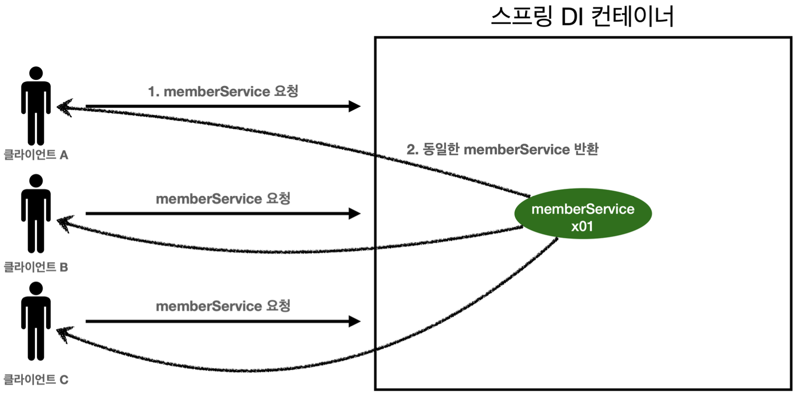
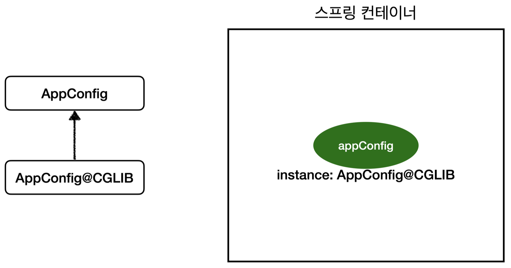

## 📌 싱글톤 컨테이너

### 싱글톤 컨테이너
> 스프링 컨테이너는 싱글톤 패턴의 문제점을 해결하면서, 객체 인스턴스를 싱글톤(1개만 생성)으로 관리한다. 지금까지 우리가 학습한 스프링 빈이 바로 싱글톤으로 관리되는 빈이다.

**싱글톤 컨테이너**
- 스프링 컨테이너는 싱글턴 패턴을 적용하지 않아도, 객체 인스턴스를 싱글톤으로 관리한다.
    - 이전에 설명한 컨테이너 생성 과정을 자세히 보자. 컨테이너는 객체를 하나만 생성해서 관리한다.
- 스프링 컨테이너는 싱글톤 컨테이너 역할을 한다. 이렇게 싱글톤 객체를 생성하고 관리하는 기능을 싱글톤 레지스 트리라 한다.
- 스프링 컨테이너의 이런 기능 덕분에 싱글턴 패턴의 모든 단점을 해결하면서 객체를 싱글톤으로 유지할 수 있다.

    - 싱글톤 패턴을 위한 지저분한 코드가 들어가지 않아도 된다.
    - DIP, OCP, 테스트, private 생성자로 부터 자유롭게 싱글톤을 사용할 수 있다.

**스프링 컨테이너를 사용하는 테스트 코드**
```java
@Test
@DisplayName("스프링 컨테이너와 싱글톤")
void springContainer() {
    ApplicationContext ac = new AnnotationConfigApplicationContext(AppConfig.class);
    //1. 조회: 호출할 때 마다 같은 객체를 반환
    MemberService memberService1 = ac.getBean("memberService", MemberService.class);
    //2. 조회: 호출할 때 마다 같은 객체를 반환
    MemberService memberService2 = ac.getBean("memberService", MemberService.class);
    //참조값이 같은 것을 확인
    System.out.println("memberService1 = " + memberService1); System.out.println("memberService2 = " + memberService2);
    
    //memberService1 == memberService2
    assertThat(memberService1).isSameAs(memberService2);
}
```

**싱글톤 컨테이너 적용 후**

- 스프링 컨테이너 덕분에 고객의 요청이 올 때 마다 객체를 생성하는 것이 아니라, 이미 만들어진 객체를 공유해서 효율적으로 재사용할 수 있다.

> 스프링의 기본 빈 등록 방식은 싱글톤이지만, 싱글톤 방식만 지원하는 것은 아니다. 요청할 때 마다 새로운 객체를 생성해서 반환하는 기능도 제공한다. 자세한 내용은 뒤에 빈 스코프에서 설명하겠다.

### 싱글톤 방식의 주의점
- 싱글톤 패턴이든, 스프링 같은 싱글톤 컨테이너를 사용하든, 객체 인스턴스를 하나만 생성해서 공유하는 싱글톤 방식은 여러 클라이언트가 하나의 같은 객체 인스턴스를 공유하기 때문에 싱글톤 객체는 상태를 유지(stateful)하 게 설계하면 안된다.
- 무상태(stateless)로 설계해야 한다!
    - 특정 클라이언트에 의존적인 필드가 있으면 안된다.
    - 특정 클라이언트가 값을 변경할 수 있는 필드가 있으면 안된다!
    - 가급적 읽기만 가능해야 한다.
    - 필드 대신에 자바에서 공유되지 않는, 지역변수, 파라미터, ThreadLocal 등을 사용해야 한다. 
- 스프링 빈의 필드에 공유 값을 설정하면 정말 큰 장애가 발생할 수 있다!!!

**상태를 유지할 경우 발생하는 문제점 예시**
```java
public class StatefulService {
    private int price; //상태를 유지하는 필드

    public void order(String name, int price) {
        System.out.println("name = " + name + " price = " + price); this.price = price; //여기가 문제!
    }

    public int getPrice() {
         return price;
    } 
}
```

**상태를 유지할 경우 발생하는 문제점 예시**
```java
import org.assertj.core.api.Assertions;
import org.junit.jupiter.api.Test;
import org.springframework.context.ApplicationContext;
import org.springframework.context.annotation.AnnotationConfigApplicationContext;
import org.springframework.context.annotation.Bean;

public class StatefulServiceTest {
    @Test
    void statefulServiceSingleton() {
        ApplicationContext ac = new AnnotationConfigApplicationContext(TestConfig.class);
        StatefulService statefulService1 = ac.getBean("statefulService",
StatefulService.class);
        StatefulService statefulService2 = ac.getBean("statefulService",
StatefulService.class);
        //ThreadA: A사용자 10000원 주문 statefulService1.order("userA", 10000); //ThreadB: B사용자 20000원 주문 statefulService2.order("userB", 20000);
        //ThreadA: 사용자A 주문 금액 조회
        int price = statefulService1.getPrice();
        //ThreadA: 사용자A는 10000원을 기대했지만, 기대와 다르게 20000원 출력 System.out.println("price = " + price);
        Assertions.assertThat(statefulService1.getPrice()).isEqualTo(20000);
    }

    static class TestConfig {
        @Bean
        public StatefulService statefulService() {
            return new StatefulService();
        }
    }
}
```

- 최대한 단순히 설명하기 위해, 실제 쓰레드는 사용하지 않았다.
- ThreadA가 사용자A 코드를 호출하고 ThreadB가 사용자B 코드를 호출한다 가정하자.
- `StatefulService` 의 `price` 필드는 공유되는 필드인데, 특정 클라이언트가 값을 변경한다.
- 사용자A의 주문금액은 10000원이 되어야 하는데, 20000원이라는 결과가 나왔다.
- 실무에서 이런 경우를 종종 보는데, 이로인해 정말 해결하기 어려운 큰 문제들이 터진다.(몇년에 한번씩 꼭 만난다.)
- 진짜 공유필드는 조심해야 한다! 스프링 빈은 항상 무상태(stateless)로 설계하자.

### @Configuration과 싱글톤

```java
 @Configuration
 public class AppConfig {
     @Bean
     public MemberService memberService() {
         return new MemberServiceImpl(memberRepository());
     }
     @Bean
     public OrderService orderService() {
         return new OrderServiceImpl(
                 memberRepository(),
                 discountPolicy());
}
     @Bean
     public MemberRepository memberRepository() {
         return new MemoryMemberRepository();
     }
... }
```

- memberService 빈을 만드는 코드를 보면 `memberRepository()` 를 호출한다. 이 메서드를 호출하면 `new MemoryMemberRepository()` 를 호출한다.
- orderService 빈을 만드는 코드도 동일하게 `memberRepository()` 를 호출한다. 이 메서드를 호출하면 `new MemoryMemberRepository()` 를 호출한다.
- 결과적으로 각각 다른 2개의 `MemoryMemberRepository` 가 생성되면서 싱글톤이 깨지는 것 처럼 보인다. 스프링 컨테이너는 이 문제를 어떻게 해결할까?

**검증 용도의 코드 추가**
```java
 public class MemberServiceImpl implements MemberService {
     private final MemberRepository memberRepository;
     //테스트 용도
    public MemberRepository getMemberRepository() {
        return memberRepository;
    }
    }
    public class OrderServiceImpl implements OrderService {
        private final MemberRepository memberRepository;
        //테스트 용도
        public MemberRepository getMemberRepository() {
                return memberRepository;
    }
}
```

- 테스트를 위해 MemberRepository를 조회할 수 있는 기능을 추가한다. 기능 검증을 위해 잠깐 사용하는 것이니 인터페이스에 조회기능까지 추가하지는 말자.

**테스트 코드**
```java
package hello.core.singleton;
import hello.core.AppConfig;
import hello.core.member.MemberRepository;
import hello.core.member.MemberServiceImpl;
import hello.core.order.OrderServiceImpl;
import org.junit.jupiter.api.Test;
import org.springframework.context.ApplicationContext;
import org.springframework.context.annotation.AnnotationConfigApplicationContext;
import static org.assertj.core.api.Assertions.*;

public class ConfigurationSingletonTest {
    @Test
    void configurationTest() {
        ApplicationContext ac = new AnnotationConfigApplicationContext(AppConfig.class);
        MemberServiceImpl memberService = ac.getBean("memberService",
MemberServiceImpl.class);
        OrderServiceImpl orderService = ac.getBean("orderService",
OrderServiceImpl.class);
        MemberRepository memberRepository = ac.getBean("memberRepository",
MemberRepository.class);
        //모두 같은 인스턴스를 참고하고 있다.
        System.out.println("memberService -> memberRepository = " +
memberService.getMemberRepository());
        System.out.println("orderService -> memberRepository  = " +
orderService.getMemberRepository());
        System.out.println("memberRepository = " + memberRepository);
        //모두 같은 인스턴스를 참고하고 있다.
        assertThat(memberService.getMemberRepository()).isSameAs(memberRepository);
        assertThat(orderService.getMemberRepository()).isSameAs(memberRepository);
    }
}

```

- 확인해보면 memberRepository 인스턴스는 모두 같은 인스턴스가 공유되어 사용된다.
- AppConfig의 자바 코드를 보면 분명히 각각 2번 `new MemoryMemberRepository` 호출해서 다른 인스턴 스가 생성되어야 하는데?
- 어떻게 된 일일까? 혹시 두 번 호출이 안되는 것일까? 실험을 통해 알아보자.

### @Configuration과 바이트코드 조작의 마법
> 스프링 컨테이너는 싱글톤 레지스트리다. 따라서 스프링 빈이 싱글톤이 되도록 보장해주어야 한다. 그런데 스프링이 자 바 코드까지 어떻게 하기는 어렵다. 저 자바 코드를 보면 분명 3번 호출되어야 하는 것이 맞다.
그래서 스프링은 클래스의 바이트코드를 조작하는 라이브러리를 사용한다.
모든 비밀은 `@Configuration` 을 적용한 `AppConfig` 에 있다.

다음 코드를 보자.
```java
@Test
void configurationDeep() {
    ApplicationContext ac = new
    AnnotationConfigApplicationContext(AppConfig.class);
    //AppConfig도 스프링 빈으로 등록된다.
    AppConfig bean = ac.getBean(AppConfig.class);
    System.out.println("bean = " + bean.getClass());
    //출력: bean = class hello.core.AppConfig$$EnhancerBySpringCGLIB$$bd479d70 }
```

- 사실 `AnnotationConfigApplicationContext` 에 파라미터로 넘긴 값은 스프링 빈으로 등록된다. 그래서 `AppConfig` 도 스프링 빈이 된다.
- `AppConfig` 스프링 빈을 조회해서 클래스 정보를 출력해보자.

`bean = class hello.core.AppConfig$$EnhancerBySpringCGLIB$$bd479d70`

순수한 클래스라면 다음과 같이 출력되어야 한다. `class hello.core.AppConfig`
그런데 예상과는 다르게 클래스 명에 xxxCGLIB가 붙으면서 상당히 복잡해진 것을 볼 수 있다. 이것은 내가 만든 클래 스가 아니라 스프링이 CGLIB라는 바이트코드 조작 라이브러리를 사용해서 AppConfig 클래스를 상속받은 임의의 다른 클래스를 만들고, 그 다른 클래스를 스프링 빈으로 등록한 것이다!



- @Bean이 붙은 메서드마다 이미 스프링 빈이 존재하면 존재하는 빈을 반환하고, 스프링 빈이 없으면 생성해서 스 프링 빈으로 등록하고 반환하는 코드가 동적으로 만들어진다.
- 덕분에 싱글톤이 보장되는 것이다.